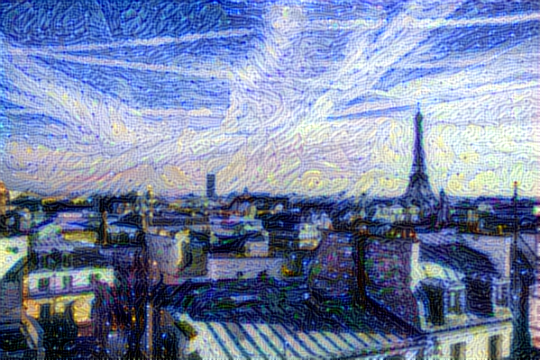

<H1> <div align="center"> Neural Style Transfer </H1>
<br>

<p align="center">
    
    
    
    
</p>
<br>
<div align="center"> 
Neural style transfer consists in generating an image with the same "content" as a base image, but with the "style" of a different picture. 
This is achieved through the optimization of a loss function that has 3 components: "style loss", "content loss", and "total variation loss".
</div>


## Implementation Details
This implementation uses TensorFlow2.x to train a fast style transfer network and Flask as an backend API.


## How to Run?
Requirements:
1. Flask
2. Tensorflow 2.x

```
python3 app.py
```

## Example
Base Image 

<div align="center"> 
    


</div>

Style Image

<div align="center"> 
    


</div>

Genrated Image
<div align="center"> 
    


</div>
